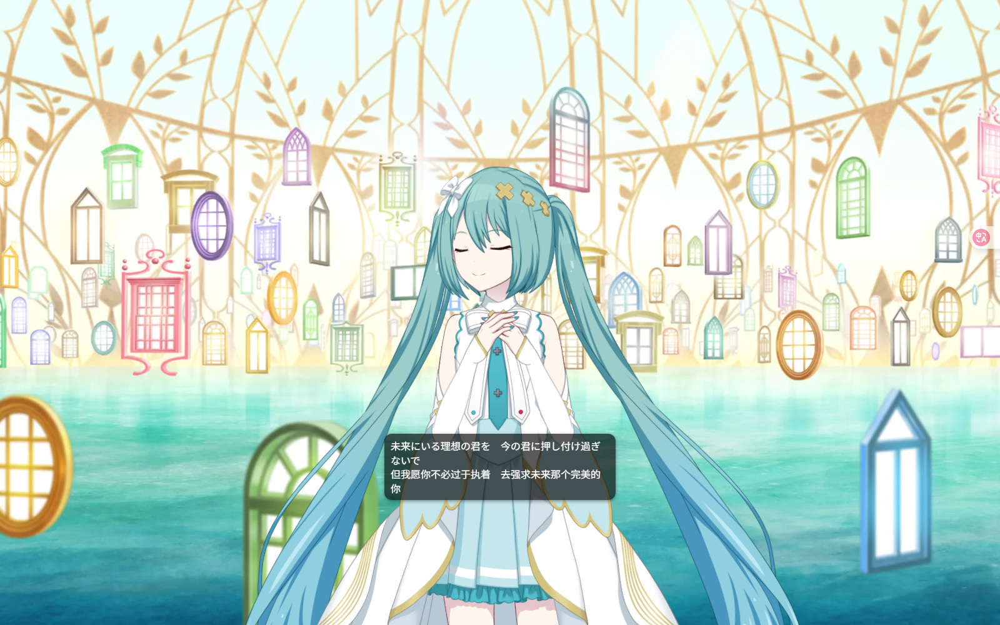
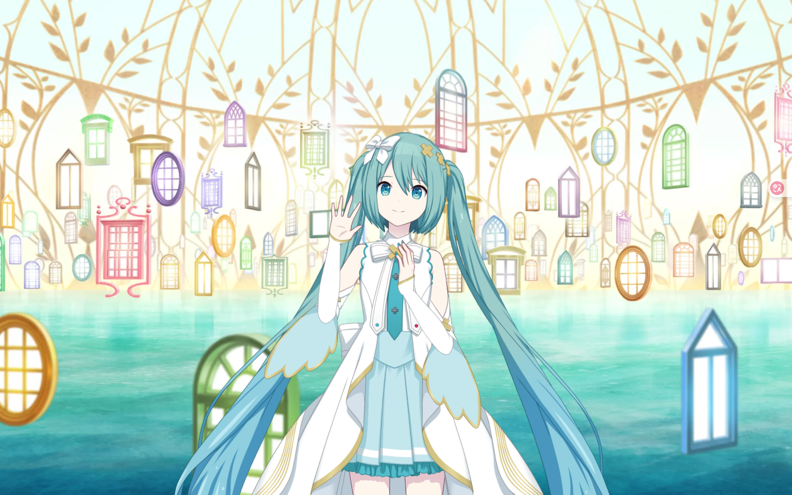
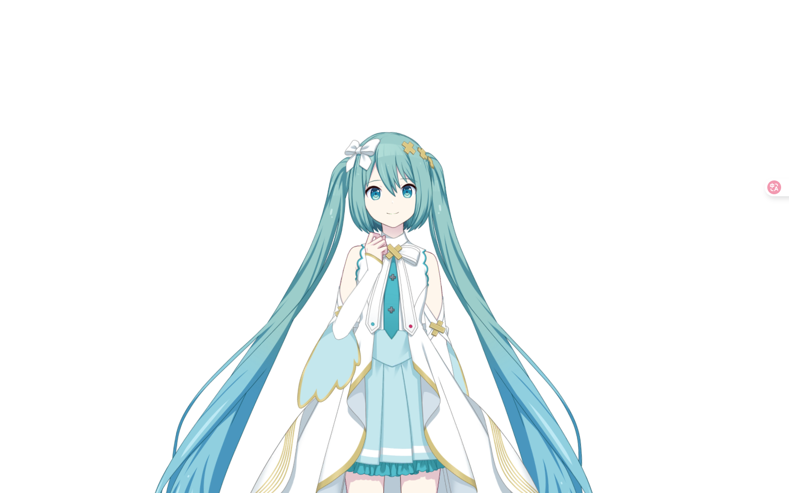

# 一场在网页中的简单Live2D演出

<div align="center">
	
	
	
</div>

## 📖 Introduction

这是一个基于 PixiJS 和 pixi-live2d-display 构建的轻量级网页彩蛋项目。

它不仅仅是一个静态的看板娘展示，而是一个具备完整演出逻辑的小型表演。项目实现了毫秒级精度的音画同步（LRC解析）和针对移动端设备的高性能渲染适配。

👉 [**在线演示**](https://www.admiralspee.site/no_mans_sekai)

## ✨ Key Features

### 音画同步系统:

编写了支持毫秒级的LRC解析引擎，实现了歌词与音乐的精确同步。同时自定义了匹配规则，实现歌词多行显示和间奏气泡消失。

支持的歌词样式：
- **[mm:ss.ms]台词**：毫秒级时间戳+台词，按时间显示台词。
- **[mm:ss]台词**：秒级时间戳+台词，按时间显示台词。
- **台词**：只有台词，作为上一段台词的第二行同时显示。
- **[mm:ss.ms]**：只有时间戳，歌词气泡停止显示，直到下一段台词。

### 演出编排：

包含开场与谢幕的自动化表演脚本，可以手动编排出场和结束时的动作表情，并在动作之间添加停顿。

如果添加了背景图片，在谢幕时图片会自动消隐。角色不会退场，谢幕后会保持最后一个动作和表情。

### 移动端适配：

智能限制最大渲染分辨率，防止高分屏手机发热掉帧。根据视口比例自动切换 PC / Mobile 布局模式，从而在不同显示设备上都能达到最好的显示效果。

### 自动播放：

适应不同浏览器的 Autoplay 策略，即使浏览器无法自动播放，也可以在点击之后开始播放，并保证音乐与歌词同步。

## 🛠️ Tech Stack

- **Core**: HTML5 / CSS3 / Vanilla JavaScript (ES6+)
- **Rendering**: PixiJS v6
- **Live2D Middleware**: pixi-live2d-display
- **Live2D Core**: Cubism Web SDK

## 🚀 Getting Started

本项目除模型、音乐和背景图片外仅有单个HTML文件，可以直接嵌入到现有的任何网站或博客页面中。

如要在本地进行测试，请在本地服务器环境下启动，不要直接双击HTML文件运行。

## ⚙️ Configuration

项目的主要配置位于`Live2D.html`的`<script>`标签顶部和代码内部：

```javascript
<!-- 1. PixiJS -->
<script src="https://unpkg.com/pixi.js@6/dist/browser/pixi.min.js"></script>

<!-- 2. Live2D Cubism Core -->
<script src="https://cubism.live2d.com/sdk-web/cubismcore/live2dcubismcore.min.js"></script>

<!-- 3. pixi-live2d-display -->
<script src="https://unpkg.com/pixi-live2d-display@0.4.0/dist/cubism4.min.js"></script>

// ======= 音乐配置 =======
const MUSIC_URL = "./assets/audio/your-song.mp3";

// ======= 模型配置 =======
const MODEL_URL = "./assets/model/your-model.model3.json";

// ======= LRC歌词 =======
const lrcText = `
[00:00.00] 填入你的歌词
[00:05.00] ...
`;

/* 背景图片 */
#live2d-bg {
  background-image: url("./assets/bg_area_25.webp");
}
```

## ⚠️ Notes

本项目中使用的模型、音频及图片文件仅供展示，版权归原作者所有(Crypton Future Media / SEGA / DECO*27 / TME)。

Fan-made project, assets belong to Crypton Future Media / SEGA / DECO*27 / TME
